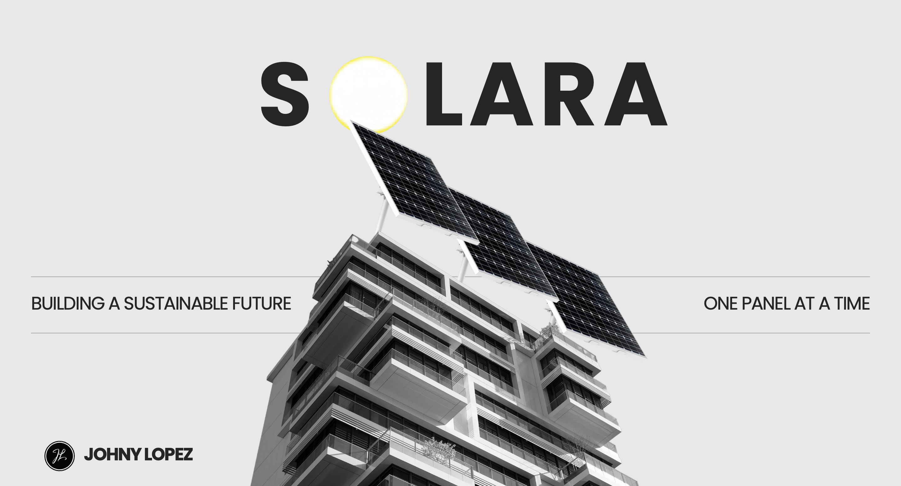

<p align="center">
  
</p>


# 🌞 SOLARA Mobile App

SOLARA is a smart solar automation platform. This mobile app is the companion to the SOLARA system, allowing users to monitor solar panel performance, view real-time energy data, and control smart solar tracking systems from anywhere.

This repository contains the iOS version of the SOLARA app, built using Swift and Xcode.

---

## 📱 Features

- Real-time solar panel monitoring
- Energy yield tracking and efficiency analytics
- Control of automated panel alignment (sun tracking)
- Remote access and push notifications
- Clean, user-friendly UI

---

## 🚀 Installation

To run this app locally on your iPhone or simulator:

1. **Clone the repository:**

   ```bash
   git clone git@github.com:johnylopez/Solar-Window.git
   cd Solar-Window

2. **Open the project in xcode**

Double click the .xcodeproj file.
